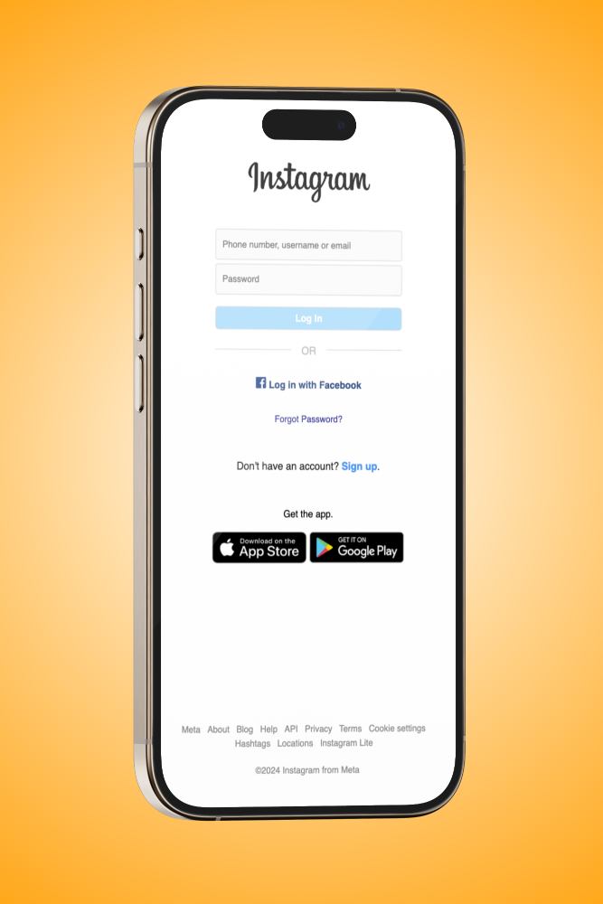
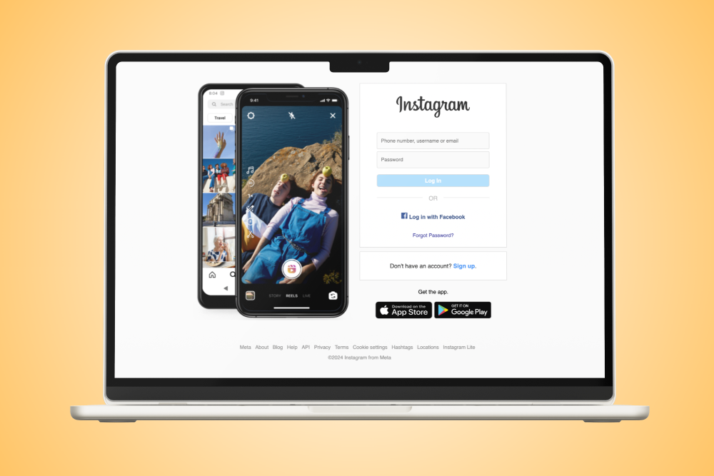

# Instagram Login Page Clone

This project is a front-end clone of the Instagram login page. The main focus is on replicating the design and layout as closely as possible, while ensuring responsive behavior on mobile devices. Please note that this project does not include functionality for link redirection or back-end logic.

## Table of Contents

- [Overview](#overview)
- [Features](#features)
- [Technologies Used](#technologies-used)
- [Responsive Design](#responsive-design)
- [Setup and Installation](#setup-and-installation)
- [Contributing](#contributing)

## Overview

This project is intended to practice front-end development skills, focusing on HTML and CSS to replicate the Instagram login page. It serves as a learning exercise in creating visually accurate web pages and ensuring responsive design for mobile users.

## Features

- **Design Clone**: A pixel-perfect recreation of the Instagram login page.
- **Responsive Design**: Fully responsive design for mobile and desktop views.
- **Static Links**: The page includes static links for demonstration purposes, without actual redirection functionality.

## Technologies Used

- **HTML5**
- **CSS3**

## Responsive Design

Special attention has been given to ensure that the layout adapts well to different screen sizes, from mobile phones to larger desktop monitors.

## Setup and Installation

1. Clone the repository to your local machine:
   ```bash
   git clone https://github.com/oftheus/Instagram-Login-Pagin-Clone.git
   ```
2. Navigate to the project directory:
   ```bash
   cd Instagram-Login-Page-Clone
   ```
3. Open `index.html` in your preferred web browser to view the page.

## Contributing

Contributions are welcome! If you have any suggestions or improvements, feel free to open an issue or submit a pull request.

---

Feel free to adjust any sections to better match your project details or personal style!




